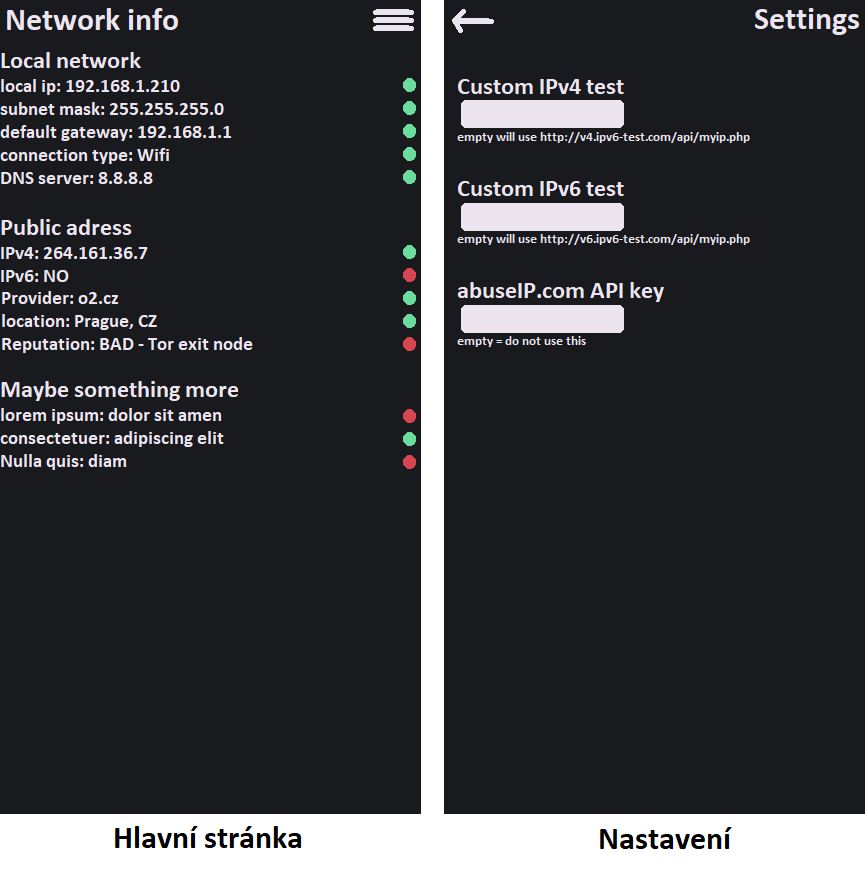

# Funkční specifikace
- verze: 1.0
- datum: 14. května 2023
- autor: Filip Komárek

## O tomto dokumentu
Účel tohoto dokumentu je specifikovat funkční požadavky.  
Dokument je určen pro uživatele, kteří chtějí lépe pochopit fungování tohoto programu.

## Použití
Software bude uživateli dávat informace o tom jeho síti. Tyto informace budou ve dvou kategoriích:

### Lokální síť
- lokální ip adresa zařízení
- maska sítě
- default gateway
- dns server

### Informace o veřejné ip adrese
- veřejná ip adresa
- poskytovatel internetu
- hostname
- lokace
- otevřené porty na ip adrese
- reputace ip adresy (jestli se jedná o Tor exit node, VPN server, nahlášená zneužití, ...)

Dále bude mít uživatel možnost vytvořit widget na ploše, aby si tyto informace mohl snadno zobrazit

## Architektura software
Software se podívá do nastavení androidu, čímž získá informace o lokální síti. Dále se připojí k veřejně přístupným API, díky kterým získá potřebné informace o veřejné ip adrese.
Tyto veřejné API jsou například:
- https://ipv6-test.com/api/
- https://ip-api.com/
- https://metrics.torproject.org/rs.html

Uživatel pak bude moct rozšířit informace v aplikaci, když zadá svůj klíč k placeným api různých služeb. Tato možnost bude v nastavení a pokud klíč k api nebude zadán, tak bude možnost vypnuta.
Mezi příklady těchto placených API patří:
- https://www.abuseipdb.com/
- https://developer.shodan.io/

Tyto seznamy se mohou časem rozšířit na základě nových zajímavých api s dalšími informacemi.

Preferované služby a klíče pro api placených služeb si bude aplikace ukládat do souboru.

## Vzhled software
Návrh vzhledu byl vytvořen. Barevná paleta byla vytvořena pomocí [coolors.co](https://coolors.co/181a1e-ece5f0-69dc9e-d64550)

## Otevřené otázky
### Ukládání dat v konfiguračním souboru
Zatím nebylo zcela vymyšleno, v jakém formátu budou ukládána data v konfiguračním souboru.